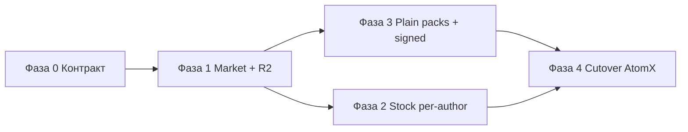

# Операция «Отречение»

План полного отказа от **`api.get-atomx.com`** (и fallback `atomx.plus`) в пользу **Motionflow next-app** + **Cloudflare R2**.

Зеркало по задачам CEP-панели:  
`CEP/spunkram-library/docs/operaciya-otrechenie.md`

---

## Цель

| Было | Станет |
|------|--------|
| Каталог паков через AtomX `mau?king=` | `GET /api/cep/market` — единственный источник каталога |
| Скачивание / sync через AtomX | Presigned URL из **private R2** через next-app gate |
| Footages: `external_lib_assets` + `track_download` на AtomX | `/api/stock/*` на next-app (Unsplash / Pexels), ключи **по автору** |
| Шифрованные паки (BIN_AX / MG_ASSET) на диске | Онлайн-чтение / install по **signed links**; локальный settings JSON **без** шифрования |

Критерий готовности: ни один runtime-путь CEP Spunkram Library и next-app (для Spunkram) не обращается к `*.get-atomx.com` / `atomx.plus`.

---

## Принципы

1. **Единый backend** — entitlement, каталог, download gate, stock proxy живут только в next-app.
2. **R2 как источник ассетов** — маркетплейс-файлы и (где нужно) превью/каталожные артефакты отдаются из R2; next-app выдаёт короткоживущие signed URL после проверки прав.
3. **Авторский scope** — stock API keys и лимиты привязаны к `client` → `author_id` (как уже сделано для generations / market).
4. **CEP тонкий** — панель не знает AtomX, не дешифрует паки, не хранит секреты стоковых провайдеров.

Уже есть задел:

- Private marketplace R2 + presign: `lib/marketplace-r2-presign.ts`, `GET /api/download/[itemId]`
- Public R2 (ZXP / ffmpeg / captions): `lib/r2-storage.ts`
- CEP market entitlements: `GET /api/cep/market`
- Stock proxy: `/api/stock/unsplash`, `/api/stock/pexels/videos`, `/api/stock/download`
- Legacy AtomX ещё в: `app/(main)/api/get-package-version/route.ts` (`mau`)

---

## Фаза 1b — Gal Toolkit Demo versioning (P0, ship-today)

Уже в коде:

- `GET /api/galtoolkit/demo?host=PR|AE` + `/download`
- `lib/galtoolkit-demo.ts` (env override + R2 `latest.json`)
- Publish: `scripts/publish-galtoolkit-demo.mjs`
- Docs: `docs/galtoolkit-demo.md`
- CEP: сравнивает `demoVersions` с remote; без подписки; fallback AtomX `try_free`

---

## Фазы

### Фаза 0 — Инвентаризация и контракт (P0)

**Задачи next-app**

- [ ] Зафиксировать полный список AtomX-зависимостей в next-app и публичных API, которые ещё дергают `get-atomx` / `mau`.
- [ ] Согласовать с CEP итоговый JSON контракт `GET /api/cep/market` как **полный** каталог (не merge поверх MAU): поля пака, превью, `install_url` / `buy_url`, version, host.
- [ ] Описать контракт install: `GET /api/cep/market/download?pack_id=…` (или эквивалент) → `303` / JSON с **presigned R2 URL** + TTL; коды `NOT_OWNED` / `SUBSCRIPTION_REQUIRED`.
- [ ] Описать контракт «settings без шифрования»: что CEP сохраняет локально (manifest / structure JSON), что всегда тянется по signed URL (бинарные ассеты).
- [ ] Env-чеклист: `R2_BUCKET`, `MARKETPLACE_SECURE_KEY_PREFIX`, per-author Unsplash/Pexels secrets.

**Выход:** этот документ + обновление `docs` CEP `BACKEND_CEP_API.md` (секции Market / Download).

---

### Фаза 1 — R2 marketplace bucket как источник маркета (P0)

**Задачи next-app**

- [ ] Подтвердить / довести private bucket layout для Spunkram-паков (согласовать с Laravel-ключом `secure/market/items/{id}/…` или ввести явный CEP-префикс).
- [ ] Миграция / синк артефактов паков автора Spunkram в R2 (скрипт upload + verify object exists).
- [ ] Каталог маркета **без AtomX**: `GET /api/cep/market` читает `marketplace_items` (MySQL) + CDN/R2 URLs для `image_url` / превью; **не** проксирует `mau`.
- [ ] Download gate для CEP: entitlement check → `getPresignedMarketplaceDownloadUrl` (или CEP-specific key builder) → redirect / `{ url, expires_in }`.
- [ ] Rate-limit на download (переиспользовать `marketplace-download-rate-limit` или CEP-scoped аналог).
- [ ] Убрать / заменить `GET /api/get-package-version` зависимость от AtomX `mau` (версия из DB / R2 manifest / `marketplace_items`).

**Выход:** маркет и install работают end-to-end через motionflow.pro + R2; AtomX не участвует в каталоге и скачивании.

---

### Фаза 2 — Stock: Unsplash / Pexels per-author (P1)

Сейчас маршруты есть и, скорее всего, используют **один** набор env-ключей. Цель — **отдельный API-аккаунт провайдера на каждого автора** (Spunkram, Gal, …).

**Задачи next-app**

- [ ] Registry ключей: `client` / `author_id` → `{ unsplashAccessKey, pexelsApiKey }` (env map или encrypted secrets table; не отдавать ключи клиенту).
- [ ] `/api/stock/unsplash`, `/api/stock/unsplash/[id]`, `/api/stock/pexels/videos`, `/api/stock/download`:
  - резолв автора из Bearer CEP / session web;
  - вызов upstream с ключом этого автора;
  - единый response shape для CEP и web.
- [ ] Attribution / download tracking на стороне next-app (замена AtomX `track_download`), если нужен audit.
- [ ] Документировать лимиты и fallback при исчерпании квоты автора.
- [ ] Создать и прописать API-аккаунты Unsplash / Pexels для Spunkram (и других авторов по мере подключения).

**Выход:** CEP footages ходят только на `motionflow.pro/api/stock/*`; ключи изолированы по автору.

---

### Фаза 3 — Паки без шифрования, online + signed (P0/P1)

Согласовано с CEP: локально больше не декодируем BIN_AX / MG_ASSET.

**Задачи next-app**

- [ ] Публиковать / хранить в R2 **plaintext** ассеты пака (или zip с plaintext), доступ только по signed URL после gate.
- [ ] Эндпоинт(ы) выдачи:
  - install zip (весь пак) — уже близко к marketplace download;
  - опционально: per-item signed URL для apply без полной локальной копии (если CEP пойдёт в online-apply).
- [ ] Каталожный / structure JSON: либо внутри zip, либо отдельный object в R2; CEP сохраняет **нешифрованный** settings/structure в userdata / packages folder.
- [ ] Короткий TTL signed URL + запрет листинга bucket; логировать отказ в gate.

**Выход:** pipeline публикации паков не использует AtomX-protection; CEP получает только signed links.

---

### Фаза 4 — Выключение AtomX (P2)

**Задачи next-app**

- [ ] Grep-gate в CI / pre-commit: запрет новых URL `get-atomx.com` / `atomx.plus` в app code.
- [ ] Удалить мёртвые прокси/хелперы AtomX headers (`atomx-secure-check` и т.п.), если больше не нужны вне legacy Laravel-port.
- [ ] Обновить внутренние docs; отметить «Отречение» завершённым для Spunkram CEP path.
- [ ] Мониторинг: 404/5xx на `/api/cep/market`, `/api/cep/market/download`, `/api/stock/*` после cutover.

**Выход:** Spunkram runtime path полностью на next-app + R2.

---

## Порядок внедрения (рекомендуемый)

1. Сначала **каталог + download на R2** (замена MAU) — снимает главную зависимость.
2. Параллельно или следом — **plaintext packs + signed** (иначе CEP всё ещё тянет decrypt).
3. Stock per-author можно катить независимо после появления Bearer-scoped stock routes.
4. Жёсткий cutover и чистка кода — когда CEP-сборка без AtomX прошла QA.

---

## Риски

| Риск | Митигация |
|------|-----------|
| Рассинхрон полей MAU vs `marketplace_items` | Фаза 0: явный mapping + фикстуры; feature-flag dual-read на короткий период только на сервере |
| Утечка R2 объектов | Private bucket only; short TTL; server-side entitlement |
| Квоты Unsplash/Pexels | Per-author keys + rate limit + понятная ошибка CEP |
| Старые зашифрованные паки у пользователей | One-time re-install из Market; deprecate decode path в CEP |

---

## Чеклист готовности (next-app)

- [ ] `GET /api/cep/market` — полный каталог без AtomX
- [ ] Download / install — только R2 presign после entitlement
- [ ] Версии паков — без `mau`
- [ ] Stock routes — per-author keys
- [ ] Нет runtime-вызовов `api.get-atomx.com` на Spunkram path
- [ ] Docs синхронизированы с CEP `operaciya-otrechenie.md`

---

## Связанные файлы (ориентир)

| Область | Путь |
|---------|------|
| R2 public | `lib/r2-storage.ts` |
| R2 market presign | `lib/marketplace-r2-presign.ts` |
| CEP market API | `app/(main)/api/cep/market/` (и download gate) |
| Stock | `app/(main)/api/stock/**` |
| Legacy AtomX version | `app/(main)/api/get-package-version/route.ts` |
| CEP client registry | `lib/cep-client-registry.ts` |
